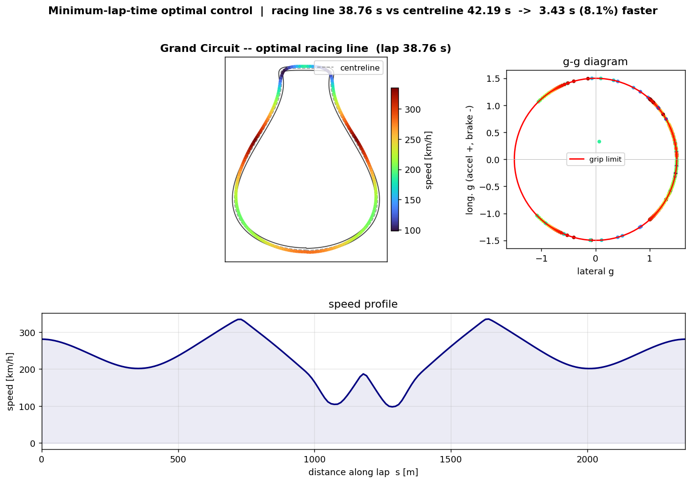

# Optimal Racing Line

The fastest line around a circuit is computed as the solution of a minimum-lap-time optimal-control
problem, rather than prescribed by hand. Given a track and a tyre-grip limit, the solver returns the
controls that minimise lap time, and the resulting line is verified against closed-form optima. The
core uses NumPy and SciPy.



## Formulation

Minimum lap time is a free-final-time optimal-control problem. The standard reformulation removes
the free final time by using arc length `s` along the track centreline as the independent variable,
so that the finish becomes a fixed boundary (`s = L`) and lap time is the integral to minimise. The
car is a point mass on a friction circle, with states `n` (lateral offset), `xi` (heading relative
to the track tangent) and `v` (speed), and controls `(a_t, a_n)` bounded by the grip limit
`a_t^2 + a_n^2 <= (mu g)^2`.

The continuous problem is transcribed to a nonlinear program by trapezoidal direct collocation: the
states and controls at the nodes are the unknowns, the dynamics become equality defect constraints
between adjacent nodes, and the objective is the trapezoidal sum of the time integrand. Analytic
Jacobians of the objective, the defects and the friction constraint are derived by hand and passed
to the solver (SciPy SLSQP). Periodic boundary conditions close the lap, which couples the corners
so that the line through one corner accounts for the next.

The optimised line reproduces the expected qualitative behaviour without it being imposed: it brakes
in a straight line, uses the full track width to increase the effective corner radius, trail-brakes
to a late apex, and returns to power on exit.

## Headline result

On a stylised 2.4 km circuit (mu = 1.5):

- The optimised line completes the lap in 38.76 s, against 42.19 s for the same car constrained to
  the geometric centreline, a gain of 3.43 s (8.1 percent).
- The car operates at the grip limit for close to the entire lap; the g-g diagram shows the
  trajectory saturating the friction circle.
- The maximum defect is about 5e-11, so the trajectory satisfies the dynamics to machine precision.

## Real-car physics on the same core

Each real-car effect adds one term to the dynamics and one analytic Jacobian row, and all default
off so the baseline remains the pure friction circle: an engine power limit `a_t <= P / (m v)`,
aerodynamic drag `a_drag = 0.5 rho Cd A v^2 / m`, and downforce, which makes the grip limit grow
with speed as `a_grip(v) = mu (g + 0.5 rho Cl A v^2 / m)`. The g-g circle then becomes a
speed-dependent performance envelope, with fast corners sustaining more lateral acceleration than
slow ones (`output/aero_envelope.png`).

## Verification

| Check | Result | Reference |
|---|---|---|
| Analytic Jacobians vs finite difference | below 1.2e-6 | exact derivatives |
| Steady corner radius | exact | `v^2 = mu g R` |
| RK4 integration order | slope 4.04 | fourth order |
| Skidpad lap time (closed form) | matches to -0.2 percent | `T = 2 pi sqrt(R / mu g)` |
| Mesh convergence of lap time | converges | trapezoidal, order `ds^2` |
| Friction-circle saturation | about 100 percent at the limit | optimal control rides the limit |

Tight defects alone only show that the NLP satisfied its own constraints, so the lap time is also
checked against the closed-form skidpad optimum, a constant-radius lap the model cannot improve on,
and shown to converge under mesh refinement.

## Sensitivity as a design tool

Because the solve is inexpensive and warm-starts across parameters, re-solving the lap while
sweeping a parameter turns the model into a trade study (`output/sensitivity.png`): lap time against
grip, against engine power, and against downforce. This is the practical use of trajectory
optimisation, answering how much a given change is worth rather than drawing a single line.

## How to run

```bash
python solver/verify_car.py     # forward car and RK4 (energy, corner, order)
python solver/verify_jac.py     # analytic Jacobians vs finite difference
python solver/run_lap.py        # the lap: racing line, g-g diagram, centreline gain, web export
python solver/verify_lap.py     # skidpad closed form, mesh convergence, saturation
python solver/sweeps.py         # aero envelope and lap-time sensitivity sweeps
```

Then open `web/index.html`, which animates the car running the optimised lap in real lap-time, with
a speed-coloured line and a live g-g dot. The data is injected, so no server is required.

## Method notes and limitations

The point mass on a friction circle is a deliberate baseline: every term in the dynamics and every
entry in the Jacobian is hand-checkable. It has no load transfer or yaw dynamics. The natural next
step is the single-track (bicycle) model with a combined-slip tyre, which would warm-start from this
solution. SLSQP is a dense sequential-quadratic-programming method and does not scale past roughly
250 nodes; a finer mesh calls for an interior-point solver (such as IPOPT) that exploits sparsity,
and the transcription and analytic Jacobians built here are exactly what such a solver requires.
Variable scaling, a quasi-steady-state warm start, and mesh continuation are what make the
closed-circuit NLP converge cleanly.

## References

1. J. T. Betts, *Practical Methods for Optimal Control and Estimation Using Nonlinear Programming*,
   2nd ed., SIAM, 2010.
2. M. Kelly, "An introduction to trajectory optimization," *SIAM Review*, 59(4), 2017.
3. G. Perantoni and D. J. N. Limebeer, "Optimal control for a Formula One car with variable
   parameters," *Vehicle System Dynamics*, 52(5), 2014.
4. D. Kraft, "A software package for sequential quadratic programming," DFVLR-FB, 1988 (SLSQP).
